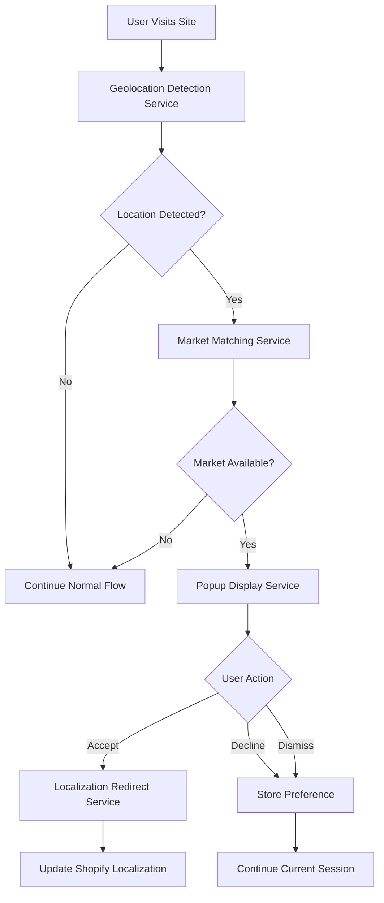

# Design Document

## Overview

The Geolocation Redirect Popup system will be implemented as a modular Shopify theme component that integrates with Shopify's native localization and Markets features. The system will detect user location, compare it against configured markets, and present a customizable popup to suggest appropriate localization settings.

The design follows Shopify theme development best practices, leveraging existing localization infrastructure while adding intelligent geolocation-based suggestions. The system will be non-intrusive, performant, and fully customizable through theme settings.

## Architecture

### High-Level Architecture



### Component Architecture

The system consists of four main components:

1. **Geolocation Detection Service** - Handles browser-based location detection
2. **Market Matching Service** - Maps detected locations to available Shopify Markets
3. **Popup Display Service** - Manages popup presentation and user interactions
4. **Localization Redirect Service** - Handles Shopify localization updates

### Integration Points

- **Shopify Localization API** - For country/language switching
- **Shopify Markets Configuration** - For available market data
- **Theme Settings** - For customization options
- **Browser Geolocation API** - For location detection
- **Local Storage** - For user preference persistence

## Components and Interfaces

### 1. Geolocation Detection Service

**Purpose:** Detect user's geographic location using browser APIs

**Interface:**
```javascript
class GeolocationDetectionService {
  async detectLocation(options = {}) {
    // Returns: { country: string, latitude: number, longitude: number }
  }
  
  isGeolocationSupported() {
    // Returns: boolean
  }
  
  handleGeolocationError(error) {
    // Handles various geolocation errors gracefully
  }
}
```

**Implementation Details:**
- Uses browser's `navigator.geolocation` API as primary method
- Falls back to IP-based geolocation services if needed
- Implements timeout handling (3-5 seconds)
- Graceful error handling for blocked/unavailable geolocation

### 2. Market Matching Service

**Purpose:** Match detected locations to available Shopify Markets

**Interface:**
```javascript
class MarketMatchingService {
  constructor(shopifyMarketsData) {
    // Initialize with Shopify Markets configuration
  }
  
  findMatchingMarket(countryCode) {
    // Returns: { market: object, currency: string, language: string } | null
  }
  
  isMarketDifferentFromCurrent(market) {
    // Returns: boolean
  }
}
```

**Implementation Details:**
- Reads Shopify Markets data from `localization.available_countries`
- Maps country codes to market configurations
- Considers currency and language preferences
- Handles market priority when multiple options exist

### 3. Popup Display Service

**Purpose:** Manage popup presentation, styling, and user interactions

**Interface:**
```javascript
class PopupDisplayService {
  constructor(settings) {
    // Initialize with theme settings
  }
  
  createPopup(marketData) {
    // Creates and styles popup element
  }
  
  showPopup(popup) {
    // Displays popup with configured animation
  }
  
  handleUserAction(action, marketData) {
    // Processes accept/decline/dismiss actions
  }
  
  shouldShowPopup() {
    // Checks user preferences and session state
  }
}
```

**Implementation Details:**
- Creates popup DOM elements dynamically
- Applies theme-configured styling
- Handles multiple popup styles (modal, corner, banner)
- Manages popup timing and auto-dismiss
- Tracks user interactions for analytics

### 4. Localization Redirect Service

**Purpose:** Handle Shopify localization updates and redirects

**Interface:**
```javascript
class LocalizationRedirectService {
  updateLocalization(marketData) {
    // Updates Shopify localization settings
  }
  
  buildRedirectUrl(marketData) {
    // Constructs proper Shopify Markets URL
  }
  
  performRedirect(url) {
    // Executes the redirect
  }
}
```

**Implementation Details:**
- Uses Shopify's localization form submission
- Constructs proper market-specific URLs
- Handles both currency and language updates
- Maintains current page context when possible

### 5. User Preference Manager

**Purpose:** Manage user preferences and session state

**Interface:**
```javascript
class UserPreferenceManager {
  hasUserDeclined() {
    // Returns: boolean
  }
  
  setUserDeclined(declined = true) {
    // Stores user preference
  }
  
  hasUserManuallySelectedLocalization() {
    // Returns: boolean
  }
  
  clearPreferences() {
    // Clears stored preferences
  }
}
```

**Implementation Details:**
- Uses localStorage for preference persistence
- Respects session-based preferences
- Handles privacy considerations
- Provides preference reset functionality

## Data Models

### Market Configuration
```javascript
{
  countryCode: "US",
  countryName: "United States",
  currency: {
    code: "USD",
    symbol: "$"
  },
  language: {
    code: "en",
    name: "English"
  },
  marketUrl: "/en-us"
}
```

### Geolocation Data
```javascript
{
  country: "US",
  countryName: "United States",
  latitude: 40.7128,
  longitude: -74.0060,
  accuracy: 100,
  timestamp: 1640995200000
}
```

### Popup Configuration
```javascript
{
  enabled: true,
  style: "modal", // "modal", "corner", "banner"
  position: "center", // "center", "top-right", "bottom-right"
  delay: 2000,
  autoDismiss: 10000,
  animation: "fade",
  colors: {
    background: "#ffffff",
    text: "#333333",
    accent: "#007bff"
  },
  text: {
    title: "Shop in your local currency",
    message: "We detected you're in {country}. Would you like to shop in {currency}?",
    acceptButton: "Yes, switch to {currency}",
    declineButton: "No, keep current settings"
  }
}
```

### User Preferences
```javascript
{
  hasDeclined: false,
  declinedAt: null,
  hasManuallySelected: false,
  lastShownAt: null,
  sessionId: "abc123"
}
```

## Error Handling

### Geolocation Errors
- **Permission Denied:** Gracefully continue without popup
- **Position Unavailable:** Log error, continue without popup
- **Timeout:** Continue without popup after 5 seconds
- **API Unavailable:** Fallback to IP-based detection or skip

### Market Matching Errors
- **No Matching Market:** Continue without popup
- **Invalid Market Data:** Log error, continue without popup
- **Shopify API Errors:** Graceful degradation

### Popup Display Errors
- **DOM Manipulation Errors:** Log error, continue without popup
- **CSS Loading Errors:** Use fallback styling
- **Animation Errors:** Display popup without animation

### Localization Errors
- **Form Submission Errors:** Show user-friendly error message
- **Redirect Errors:** Fallback to current page refresh
- **URL Construction Errors:** Use default localization

## Testing Strategy

### Unit Testing
- **Geolocation Detection Service:** Mock browser APIs, test error scenarios
- **Market Matching Service:** Test country-to-market mapping logic
- **Popup Display Service:** Test DOM manipulation and styling
- **Localization Redirect Service:** Test URL construction and form handling

### Integration Testing
- **End-to-End Flow:** Test complete user journey from detection to redirect
- **Shopify Integration:** Test with actual Shopify Markets configuration
- **Cross-Browser Testing:** Ensure compatibility across major browsers
- **Mobile Testing:** Verify responsive design and touch interactions

### Performance Testing
- **Load Time Impact:** Measure impact on page load performance
- **Memory Usage:** Monitor JavaScript memory consumption
- **API Response Times:** Test geolocation API performance
- **Popup Rendering:** Measure popup display performance

### User Acceptance Testing
- **Popup Usability:** Test user interaction flows
- **Customization Options:** Verify theme settings functionality
- **Accessibility:** Test keyboard navigation and screen readers
- **Multi-language Support:** Test with various language configurations

### Browser Compatibility Testing
- **Modern Browsers:** Chrome, Firefox, Safari, Edge (latest versions)
- **Mobile Browsers:** iOS Safari, Chrome Mobile, Samsung Internet
- **Geolocation Support:** Test fallback behavior for unsupported browsers
- **JavaScript Disabled:** Ensure graceful degradation

## Implementation Considerations

### Performance Optimization
- Lazy load geolocation detection after page load
- Use efficient DOM manipulation techniques
- Minimize JavaScript bundle size
- Implement proper caching strategies

### Privacy and Security
- Respect user privacy preferences
- Handle geolocation permissions properly
- Secure storage of user preferences
- Comply with privacy regulations (GDPR, CCPA)

### Accessibility
- Ensure popup is keyboard navigable
- Provide proper ARIA labels
- Support screen readers
- Maintain focus management

### Internationalization
- Support RTL languages
- Handle various currency formats
- Respect cultural preferences
- Test with different character sets

### Analytics Integration
- Track popup display events
- Monitor user interaction rates
- Measure conversion impact
- Provide actionable insights